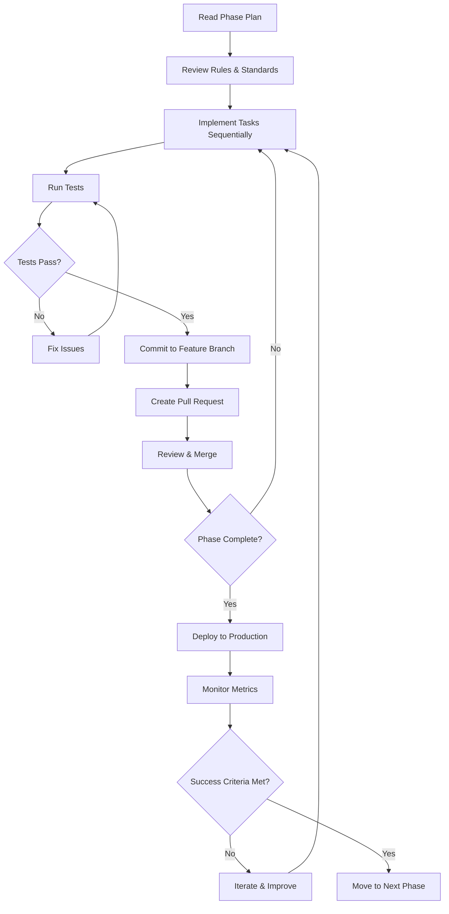

# TinniTune Agent Implementation System

This directory contains structured implementation plans to transform TinniTune into the leading tinnitus therapy app on the market.

## 🎯 Vision
Create a clinical-grade tinnitus therapy app that combines evidence-based treatment with exceptional user engagement, AI-driven personalization, and measurable clinical outcomes.

## 📁 Directory Structure

```
.agent/
├── README.md                          # This file - overview and usage
├── phases/                            # Phase-specific implementation plans
│   ├── phase-1-quick-wins.md         # 1-2 weeks - High impact, moderate effort
│   ├── phase-2-engagement-boost.md   # 4-6 weeks - Enhanced engagement features
│   └── phase-3-market-leader.md      # 8-12 weeks - Market differentiation
├── rules/                             # Implementation standards and guidelines
│   ├── implementation-standards.md   # Code quality and patterns
│   ├── testing-requirements.md       # Testing criteria for each feature
│   ├── accessibility-guidelines.md   # WCAG compliance and UX standards
│   └── clinical-validation.md        # Evidence-based requirements
└── tasks/                             # Individual task breakdowns
    ├── quick-wins/                   # Phase 1 tasks
    ├── engagement/                   # Phase 2 tasks
    └── differentiation/              # Phase 3 tasks
```

## 🚀 How to Use This System

### Option 1: Manual Implementation (Traditional)
1. Read the phase plan in `phases/`
2. Work through tasks sequentially
3. Follow implementation standards in `rules/`
4. Test according to `testing-requirements.md`
5. Commit and push to feature branch

### Option 2: Claude Agent-Driven (Recommended)
```bash
# From TinniTune root directory
# Ask Claude to implement a specific phase:
"Implement Phase 1 Quick Wins following .agent/phases/phase-1-quick-wins.md"

# Or implement a specific task:
"Implement task .agent/tasks/quick-wins/01-session-duration-messaging.md"

# Or use the Task tool:
"Use the Plan agent to review .agent/phases/phase-1-quick-wins.md and create an implementation plan"
```

### Option 3: GitHub Issues Integration (Best for Teams)
```bash
# Generate GitHub issues from agent plans
"Create GitHub issues for all Phase 1 tasks from .agent/tasks/quick-wins/"

# Each issue will have:
# - Clear acceptance criteria
# - Implementation guidelines
# - Testing requirements
# - Time estimate
```

### Option 4: Slash Command Automation (Advanced)
Create custom slash commands in `.claude/commands/`:
```bash
/implement-phase-1  # Runs full Phase 1 implementation
/implement-task <task-name>  # Implements specific task
/validate-phase <phase-number>  # Runs all tests for a phase
```

## 📊 Success Metrics

Each phase has defined success criteria:

### Phase 1 (Quick Wins)
- [ ] Average session duration increases to 35+ minutes
- [ ] Achievement unlock rate improves by 40%+
- [ ] Daily active users increase by 20%+
- [ ] User reviews mention "beautiful animations" and "helpful reminders"

### Phase 2 (Engagement Boost)
- [ ] 70%+ of users complete Week 1 of structured program
- [ ] Retention at 1 month reaches 65%+
- [ ] Users report "personalized insights" as top feature
- [ ] Offline usage accounts for 15%+ of sessions

### Phase 3 (Market Differentiation)
- [ ] 25%+ of users share data with healthcare providers
- [ ] Focus training game has 50%+ adoption rate
- [ ] Clinically meaningful reduction in 32%+ of users
- [ ] App ranks in top 3 for tinnitus therapy (App Store/Play Store)

## 🔄 Implementation Workflow



## 🛠️ Automation Recommendations

### 1. **GitHub Actions Workflows**
Create `.github/workflows/phase-validation.yml`:
- Automatically run tests when PR targets phase branch
- Validate accessibility standards
- Check clinical compliance (volume limits, session tracking)
- Performance benchmarks

### 2. **Pre-commit Hooks**
- Lint code against implementation standards
- Verify audio safety patterns
- Check for accessibility violations
- Validate localStorage key conventions

### 3. **Agent-Driven Development**
- Use Claude's Task tool with `subagent_type=Plan` to generate detailed implementation steps
- Use Claude's Task tool with `subagent_type=general-purpose` to implement complex features
- Leverage parallel Task execution for independent features

### 4. **Issue Templates**
Create `.github/ISSUE_TEMPLATE/feature-implementation.md`:
```markdown
## Feature: [Name]
**Phase:** [1/2/3]
**Agent Task File:** `.agent/tasks/[path]`
**Estimated Time:** [X hours/days]

## Implementation Checklist
- [ ] Read implementation standards
- [ ] Review clinical validation requirements
- [ ] Implement feature
- [ ] Write tests
- [ ] Test accessibility
- [ ] Update documentation
- [ ] Create PR

## Success Criteria
[Auto-populated from task file]
```

## 📅 Timeline Overview

| Phase | Duration | Focus | Key Deliverables |
|-------|----------|-------|------------------|
| **Phase 1** | 1-2 weeks | Quick wins with high impact | Session messaging, animations, reminders, nature sounds |
| **Phase 2** | 4-6 weeks | User engagement & retention | Structured program, AI insights, EMA, offline mode |
| **Phase 3** | 8-12 weeks | Market leadership | Provider integration, mini-game, CBT library, A/B testing |

**Total Timeline:** 13-20 weeks to market-leading position

## 🎓 Learning Resources

- [Tone.js Documentation](https://tonejs.github.io/)
- [Web Audio API Specification](https://www.w3.org/TR/webaudio/)
- [PWA Best Practices](https://web.dev/progressive-web-apps/)
- [WCAG 2.1 Guidelines](https://www.w3.org/WAI/WCAG21/quickref/)
- [Clinical Tinnitus Research](https://pmc.ncbi.nlm.nih.gov/articles/PMC7698350/)

## 🤝 Contributing

When implementing features:
1. **Always** read the relevant rules in `.agent/rules/`
2. **Follow** the implementation standards exactly
3. **Test** against the testing requirements
4. **Document** your changes in the task file
5. **Update** success metrics as you progress

## 📞 Getting Help

If you encounter blockers:
1. Check `.agent/rules/implementation-standards.md` for patterns
2. Review `CLAUDE.md` for TinniTune-specific guidelines
3. Search previous commits for similar implementations
4. Ask Claude to review the specific task file and provide guidance

## 🎯 Next Steps

1. **Review** `.agent/phases/phase-1-quick-wins.md`
2. **Choose** implementation method (Manual, Agent-Driven, or GitHub Issues)
3. **Start** with the first task in Phase 1
4. **Track** progress using success metrics
5. **Iterate** based on user feedback and analytics

---

**Let's build the best tinnitus therapy app on the market! 🚀**
